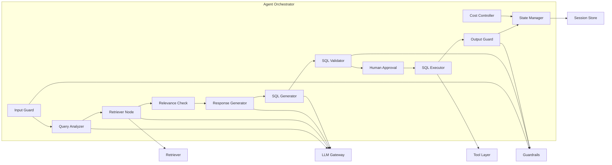

# C4 Component Diagram: Agent Orchestrator

> Status note: this diagram describes the legacy LangGraph orchestrator. The current production `/query` path uses a simpler FastAPI flow plus memory lookup; the graph is still kept for `/query/stream` and experiments.

Внутреннее устройство ядра системы - Agent Orchestrator (LangGraph). Компоненты ниже являются внутренними частями одного runtime-модуля, а не отдельными сервисами.

## Описание компонентов

| Компонент | Тип узла | LLM | Описание |
|-----------|----------|-----|----------|
| **Input Guard** | Синхронный | Нет | Regex-фильтры, проверка длины, injection classifier. Первая линия защиты. |
| **Query Analyzer** | Синхронный | Да, через gateway | Structured output: {intent, entities, db_hint}. Few-shot промпт с примерами. |
| **Retriever Node** | Синхронный | Да, через gateway | Вызов Qdrant → top-20 → conditional LLM rerank → top-5. Payload filtering по db_hint и enrichment через metadata. |
| **Relevance Check** | Синхронный | Нет | Порог confidence (default 0.6). При низком - conditional edge на clarification. |
| **Response Generator** | Синхронный | Да, через gateway | Формирует путь (DB → schema → table → columns) + NL-объяснение. Structured output. |
| **SQL Generator** | Синхронный | Да, через gateway | Генерирует read-only SQL-запрос. Ограничен контекстом найденных таблиц. |
| **SQL Validator** | Синхронный | Нет | sqlglot.parse() + whitelist/blacklist правила. Детерминированная проверка. |
| **Human Approval** | Interrupt | Нет | LangGraph interrupt - ожидание ответа пользователя через API. |
| **SQL Executor** | Синхронный | Нет | SQLAlchemy read-only connection. Timeout 10s. LIMIT 100 rows. |
| **Output Guard** | Синхронный | Нет | Pydantic validation финального ответа. Фильтрация PII-паттернов. |
| **Cost Controller** | Синхронный | Нет | Проверяется после каждого LLM-вызова. При превышении budget → early stop. |
| **State Manager** | Implicit | Нет | AgentState TypedDict - единый state для всего графа. Checkpointed в SQLite. |
| **LLM Gateway** | Внешний сервис | Да | Выполняет model selection, provider fallback, schema parsing и provider telemetry. |
