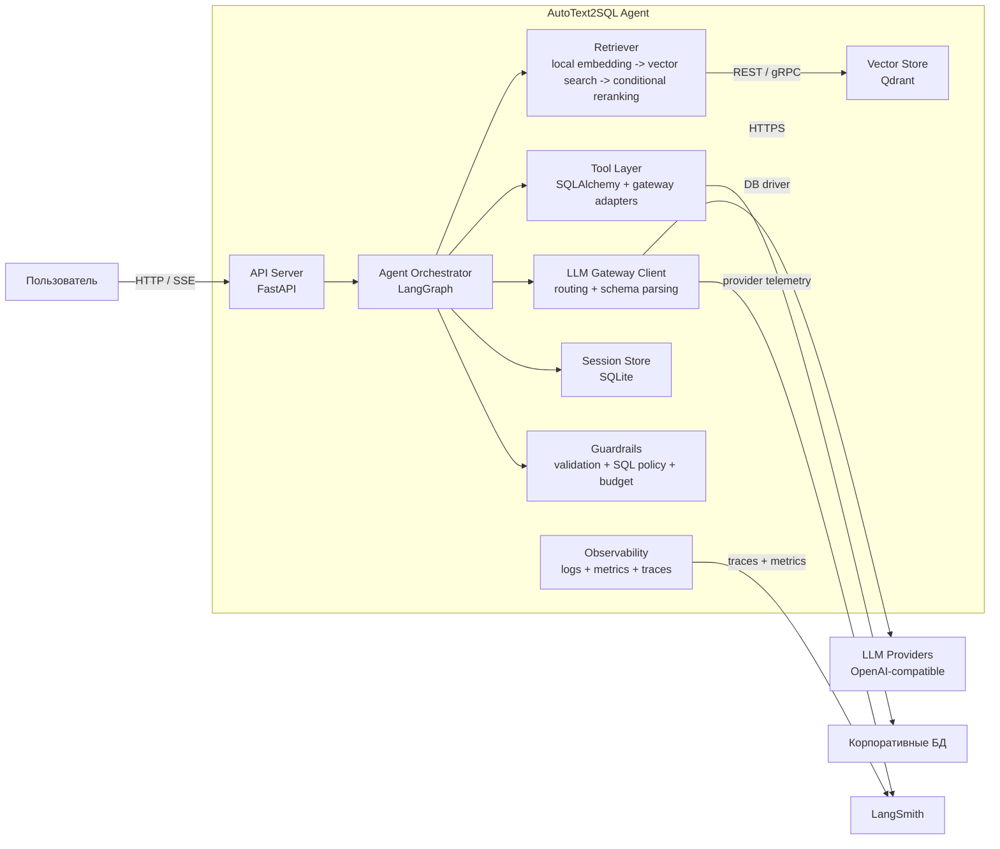

# C4 Container Diagram: AutoText2SQL Agent

Внутренние контейнеры системы и их взаимосвязи.

## Ответственность контейнеров

| Контейнер | Технология | Что делает | Что НЕ делает |
|-----------|-----------|------------|---------------|
| **API Server** | FastAPI | Приём запросов, SSE-стриминг, authN, rate limit | Бизнес-логику, LLM-вызовы |
| **Agent Orchestrator** | LangGraph | Управление шагами графа, state transitions, retry/fallback. Внутри него живут `Query Analyzer`, `Response Generator`, `SQL Generator`, `Cost Controller` и state management | Прямые обращения к внешним API |
| **Retriever** | Python + Qdrant | Vector search, payload filtering, reranking | Индексацию (это задача offline pipeline) |
| **Tool Layer** | SQLAlchemy, internal adapters | Адаптеры к внешним системам с единым интерфейсом ToolResult | Принятие решений о control flow |
| **LLM Gateway Client** | HTTP client + schema parser | Обращение к gateway, нормализация structured output, fallback metadata | Прямой выбор бизнес-логики графа |
| **Vector Store** | Qdrant | Хранение и поиск эмбеддингов | Бизнес-логику, reranking |
| **Session Store** | SQLite | Персистентность state сессий LangGraph | Долгосрочное хранение данных |
| **Guardrails** | sqlglot, regex, Pydantic | Валидация, policy enforcement, cost control | Генерацию контента |
| **Observability** | structlog, OTEL | Логирование, метрики, трейсы | Alerting (внешняя система) |
