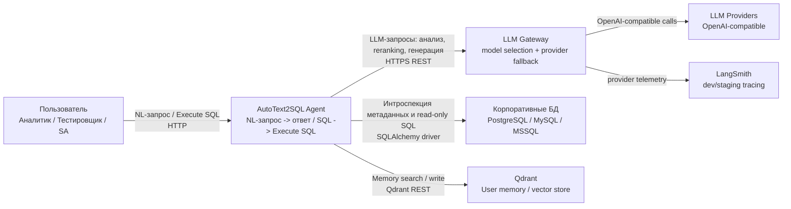

# C4 Context Diagram: AutoText2SQL Agent

Границы системы, пользователи и внешние зависимости.

## Описание границ

| Элемент | Зона ответственности | Граница доверия |
|---------|---------------------|-----------------|
| **User** | Формулировка запроса, подтверждение SQL | Внешний. Ввод не доверенный, проходит input guardrail. |
| **AutoText2SQL Agent** | Весь контур обработки: от запроса до ответа | Внутренняя зона доверия. Все модули - единый процесс. |
| **LLM Gateway** | Выбор модели, schema parsing, structured completions и provider fallback | Внешний gateway API. Нормализует ответы и маршрутизирует вызовы по провайдерам. |
| **LLM Providers** | Конкретные модели и провайдеры | Используются gateway как downstream-слой. |
| **Qdrant** | Хранение и поиск user memory для conversational flow | Внешний сервис внутри runtime-окружения. Используется memory layer через `mem0`. |
| **Embedding API** | Embeddings метаданных и запросов | Внешний OpenAI-compatible API (например, OpenRouter). |
| **Корпоративные БД** | Источник истины по метаданным и данным | Внешние, read-only доступ. Timeout 10s на запрос. |
| **LangSmith** | Опциональная наблюдаемость | Внешний SaaS. Отсутствие не влияет на работу системы. |
