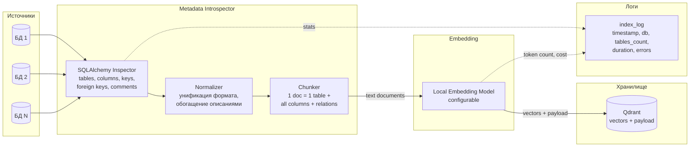
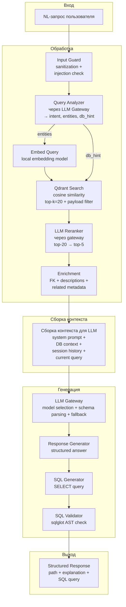
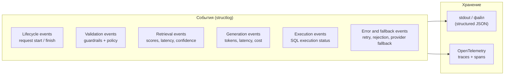

# Data Flow Diagram: AutoText2SQL Agent

Как данные проходят через систему: что создаётся, что хранится, что логируется.

## 1) Indexing Pipeline (offline)

### Что хранится в Qdrant

| Поле | Тип | Пример |
|------|-----|--------|
| id | string | prod_db.public.orders |
| document | text | "Table: orders. Schema: public. DB: prod_db. Columns: id (int, PK), user_id (int, FK→users.id), status (varchar), created_at (timestamp). Описание: Заказы пользователей." |
| embedding | float[n] | - |
| metadata.db_name | string | prod_db |
| metadata.schema_name | string | public |
| metadata.table_name | string | orders |
| metadata.object_type | string | table |
| metadata.column_names | string | id,user_id,status,created_at |
| metadata.has_description | bool | true |

## 2) Query Pipeline (online)

## 3) Что логируется

### Таблица логируемых данных

| Что | Логируется | НЕ логируется |
|-----|-----------|---------------|
| NL-запрос пользователя | ✅ Полный текст | - |
| Сгенерированный SQL | ✅ Полный текст + hash | - |
| Список затронутых объектов БД | ✅ db/schema/table | - |
| Результаты SQL (данные из БД) | ⚠️ Только row count | ❌ Содержимое строк |
| Метрики (latency, cost, tokens) | ✅ По каждому шагу | - |
| Ошибки и причины отказа | ✅ Полный стек-трейс | - |
| Оценки релевантности | ✅ Scores для top-k | - |
| PII / персональные данные | - | ❌ Не обрабатываются (тестовые стенды) |

## 4) Жизненный цикл данных

| Данные | Создание | Хранение | TTL | Обновление |
|--------|----------|----------|-----|------------|
| Метаданные БД (raw) | Introspection | Только в памяти во время индексации | - | При re-index |
| Embeddings + payload | Indexing pipeline | Qdrant (Docker volume) | Бессрочно | Полная переиндексация |
| Session state | Первый запрос в сессии | SQLite (LangGraph checkpointer) | До перезапуска сервера | Каждый шаг графа |
| Логи | Каждое событие | stdout / файл | 30 дней (ротация) | Append-only |
| Traces | Каждый LLM-вызов | OpenTelemetry → LangSmith | 7 дней (LangSmith free tier) | Append-only |
| Cost counters | Каждый LLM-вызов | In-memory + периодический flush в файл | Daily/weekly reset | Инкремент |
