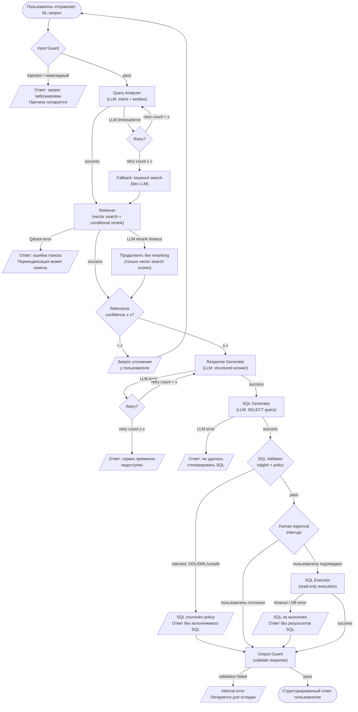

# Workflow Diagram: Query Execution

Пошаговое выполнение запроса пользователя, включая все ветки ошибок и fallback.

## Основной flow

## Таблица ветвей ошибок

| Точка отказа | Тип | Fallback | Ответ пользователю |
|-------------|------|----------|---------------------|
| Input Guard reject | Hard stop | - | "Запрос заблокирован по причине безопасности" |
| Query Analyzer LLM fail | Degraded | Keyword search | Менее точные, но доступные результаты |
| Qdrant error | Hard stop | - | "Ошибка поисковой системы" |
| Reranking LLM fail | Degraded | Vector scores only | Результаты без LLM-ранжирования |
| Low relevance | User action | Clarification | "Уточните запрос: ..." |
| Response Gen LLM fail | Hard stop | - | "Сервис временно недоступен" |
| SQL Gen LLM fail | Hard stop | - | "Не удалось сгенерировать SQL-запрос" |
| SQL Validator reject | Degraded | Skip SQL | Ответ без исполняемого SQL-запроса (SQL не прошёл проверку) |
| Human rejects SQL | Normal | - | Ответ без выполнения SQL |
| SQL Executor fail | Degraded | Skip results | Ответ с SQL-запросом, но без результатов |
| Output Guard fail | Hard stop | - | "Внутренняя ошибка" |
